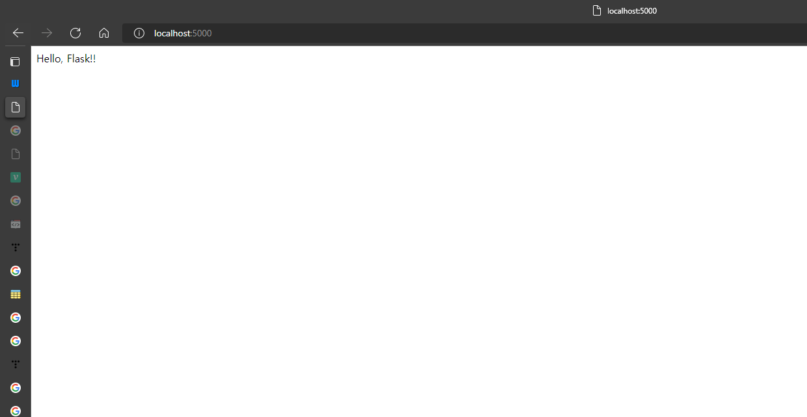

# 애플리케이션 팩토리
애플리케이션 팩토리함수인 **create_app()** 을 사용하여 애플리케이션을 만들어봅시다.

```
from flask import Flask

def create_app():
    app = Flask(__name__)

    @app.route('/')
    def hello_flask():
        return 'Hello, Flask!!'

    return app
```
위 코드는 애플리케이션 함수인 create_app()를 사용하여 app을 생성한 것입니다.
create_app함수는 app객체를 생성한 후 hello_flask()함수를 거친 후 app을 반환하는 방식입니다.
이 때 creat_app함수는 플락스크 내부에서 정의된 함수이므로 다른 이름으로 변경하여 사용하면 안됩니다.


위 코드를 실행시킨 후 127.0.0.1:5000으로 접속하면 위 화면이 나오는 것을 확인할 수 있습니다.