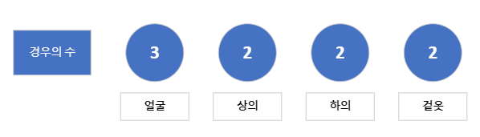

# **Programmers 땅따먹기**

### [문제] [프로그래머스] level2. 위장(Java)
문제 링크 : https://school.programmers.co.kr/learn/courses/30/lessons/42578

## **제한 조건**
* clothes의 각 행은 [의상의 이름, 의상의 종류]로 이루어져 있습니다.
* 스파이가 가진 의상의 수는 1개 이상 30개 이하입니다.
* 같은 이름을 가진 의상은 존재하지 않습니다.
* clothes의 모든 원소는 문자열로 이루어져 있습니다.
* 모든 문자열의 길이는 1 이상 20 이하인 자연수이고 알파벳 소문자 또는 '_' 로만 이루어져 있습니다.
* 스파이는 하루에 최소 한 개의 의상은 입습니다.

## **입출력 예**

|clothes| return  |
|:---:|:-------:|
|[["yellow_hat", "headgear"], ["blue_sunglasses", "eyewear"], ["green_turban", "headgear"]]|    5    |
|[["crow_mask", "face"], ["blue_sunglasses", "face"], ["smoky_makeup", "face"]]|    3    |

## 문제 핵심
* 같은 의상의 종류는 존재하지 않는다.
* 스파이는 하루에 최소 한 개의 의상은 입어야한다.
* 서로 다른 옷의 조합의 고를 때 중복되는 종류가 있으면 안된다.

## **문제 풀이 + 접근 방법**
* 중복되지 않는 옷 종류의 수를 구하는 문제인 것으로 보아 Hash를 사용하면 쉽게 풀릴 것 같았습니다.
* 경우의 수를 모두 나열해보니 의상의 종류별로 나열 한 후 종류별로의 개수를 모두 곱하면 모든 경우의 수를 구할 수 있었습니다.
### EX)
|  종류  |    이름    |
|:----:|:---------:|
|  얼굴  | 안경, 선글라스 |
|  상의  | 파란색 티셔츠|
|  하의 |청바지|
|겉옷| 긴 코트|
<br>



위에 표와 같이 얼굴의 2종류 상의에 1종류 하의에 1종류 겉옷에 1종류가 있으면
각 종류에 들어올 수 있는 경우의 수는 그림과 같습니다.  
이러한 조건에서 경우에 수를 구하면  
3 * 2 * 2 * 2 = 24가 나오는데 모두 0인 경우의 수를 빼줘야합니다.  
즉, 스파이가 입을 수 있는 종류의 수는 23.

1. 키가 String(옷의 종류)이고 value가 Integer(옷 종류의 개수)인 HashMap을 선언한다.
2. for문을 이용하여 HashMap에 옷의 종류가 존재하면 value값을 증가, 존재하지 않으면 Map추가
3. for문을 사용하여 HashMap의 Value값들 모두 곱해준다.
4. 직전 옷을 모두 안입읍 경우의 수 1를 빼주고 return.

## **내가 작성한 코드**
```java
import java.util.HashMap;
public class Solution {
    public int solution(String[][] clothes){
        int answer = 1;
        HashMap<String, Integer> hashCount = new HashMap<>();

        for (int i = 0; i < clothes.length ; i++){

            if (!hashCount.containsKey(clothes[i][1])) {
                hashCount.put(clothes[i][1], 1);
            }else {
                hashCount.replace(clothes[i][1], hashCount.get(clothes[i][1]) + 1);
            }
        }

        for (int tmp : hashCount.values()){
            answer = answer * (tmp + 1);
        }

        return answer - 1;
    }
}

```